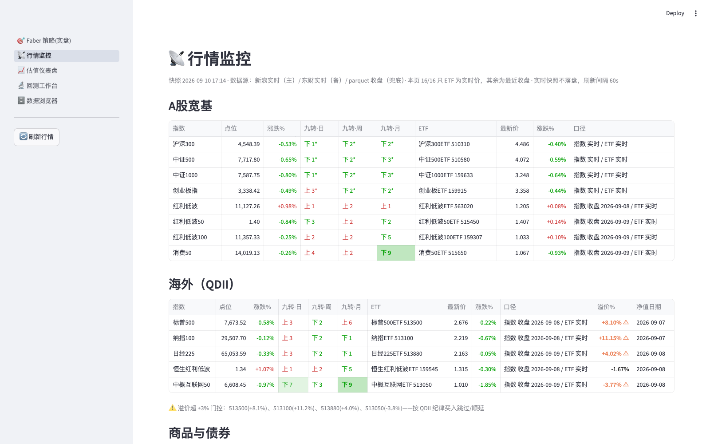
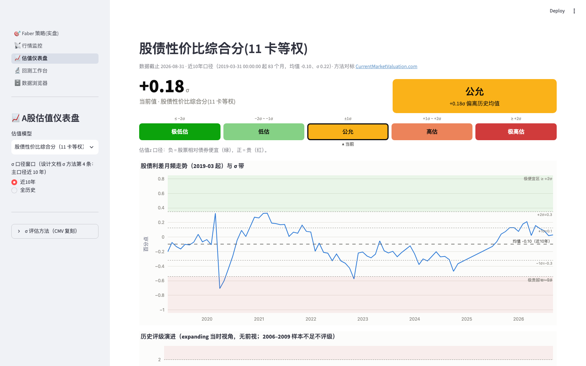
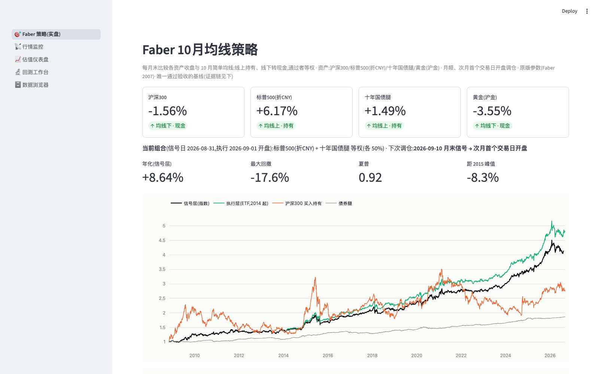

<div align="center">

# 🧭 paseo

[](README.md)
[](README.en.md)

**A quantitative index/ETF investing system for China's A-share market**
Valuation dashboard · Tactical strategy live tracking · Market monitor · Rigorous backtesting

[](https://baiyunshan.streamlit.app/)
[](https://www.python.org/)
[](https://streamlit.io/)
[](#-tech-stack)
[](LICENSE)

</div>

---

## Screenshots

<div align="center">

<p><em>📡 Market Monitor — realtime quote board · TD Setup on daily/weekly/monthly (tinted at ≥7, deepened at 9) · QDII premium alerts beyond ±3%</em></p>

<p><em>📈 Valuation Dashboard — 14-model composite score · 5-tier rating · IC validation at the bottom (3-yr rank IC −0.72)</em></p>

<p><em>🎯 Faber Strategy (live) — current holdings · distance to MA · next rebalance · signal/execution dual-layer NAV</em></p>
</div>

## What is this

A **data-driven** toolbox for index investing in Chinese A-shares. Every day it automatically fetches 58 datasets (index quotes / ETFs / QDII NAVs / valuations / macro), feeds them into valuation models, tactical strategies and a backtest engine, and presents everything in one web app —

**👉 Nothing to install, just open it: [baiyunshan.streamlit.app](https://baiyunshan.streamlit.app/)** (UI in Chinese)

## Five pages

| Page | Contents |
|---|---|
| 🎯 **Faber Strategy (live)** | The 10-month moving-average timing strategy from a practitioner's view: current holdings, distance to MA, next rebalance date. Passed main tests ✅ / walk-forward ✅ / holdout accepted after human review |
| 📡 **Market Monitor** | Quote board of 12 indices + 16 ETFs (Sina/Eastmoney realtime + EOD fallback), **TD Setup ("Magic Nine") on daily/weekly/monthly levels** (tinted background at ≥7, deepened + bold at the 9 completion), **QDII premium monitoring** (alert beyond ±3% gate) |
| 📈 **Valuation Dashboard** | 14 macro/valuation model cards (Buffett Indicator, ERP, margin debt, QVIX, dividend spread, PMI…) → standardized σ composite score with 5-tier rating; bottom section shows **IC validation**: composite score vs. future 3-year returns, Spearman rank IC −0.72 |
| 🔬 **Backtest Workbench** | Two-layer GEM dual-momentum backtest localized for China/US, parameter sensitivity heatmaps, four baseline strategy comparisons |
| 🗄 **Data Browser** | All 58 datasets at a glance: rows / date range / source; any table plottable, one-click incremental update from the sidebar |

## Why it's worth a star

- **Honest, no survivorship bias** — Four baseline strategies reproduced with public results: GEM ❌ / Faber ✅ / FED ❌ / GTAA ❌. What failed the tests is marked ❌, in the app and the docs alike
- **Models must validate themselves first** — The composite valuation score is not gut-feel weighting: expanding-window (no lookahead) Spearman IC against future 1/3-year returns, with the IC table and scatter plot shown right on the page
- **Provenance on every number** — Every figure carries its source and timestamp (realtime / close / NAV fallback). "No number goes on a page without a stated data caliber" is a hard rule in the design docs
- **Resilient data pipeline** — Every source ships with a primary→fallback fetch chain (Eastmoney → Sina/Tencent/CSI official), GitHub Actions runs incremental updates daily, tolerating partial failures with checkpoint resume
- **QDII premium discipline** — Premium = ETF price ÷ latest unit NAV (point-in-time caliber); alerts beyond the ±3% gate, wired to a "skip/defer buys when premium exceeds the gate" trading discipline

## Quick start

```bash
git clone https://github.com/coboo/paseo.git
cd paseo
uv sync
uv run streamlit run app/paseo.py     # all five pages
```

Data ships with the repo (parquet, ~10MB) — clone and run. Manual incremental updates:

```bash
PYTHONPATH=src uv run python -m data_module.update          # everything
PYTHONPATH=src uv run python -m data_module.update cn10y    # by name
```

## Tech stack

**Streamlit** five-page app · **akshare** multi-source fetching (primary→fallback chains) · **pandas/pyarrow** parquet storage (append-only raw layer) · **GitHub Actions** daily auto-update at 09:00 UTC · page-level regression tests with Streamlit AppTest

```
data/raw (58 parquet datasets) → src/metrics + src/strategy → data/derived → app/ five pages
```

## Disclaimer

This project is for personal investment research and learning only. All strategy backtests and model scores **do not constitute investment advice**. Past performance does not guarantee future results. Investing involves risk.

---

<div align="center">
If this tool helps you, a ⭐ means a lot — it's the biggest motivation to keep it updated
</div>
